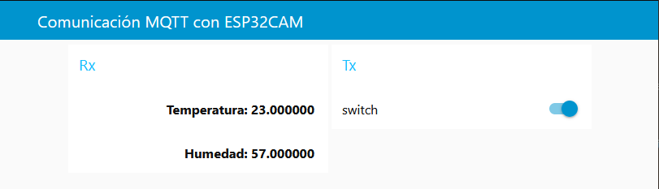

### El código fue modificado por [Víctor Estupiñán](https://github.com/WihoverEsal), y esta basado en el repositorio https://github.com/codigo-iot/ESP32CAM_MQTT-Basic.git

# ESP32CAM_MQTT-Basic
Este es el programa para enviar datos de temperatura :thermometer: y humedad :droplet: capturados por el sensor DHT11 y ademas recibe mensajes a través del protocolo MQTT con el ESP32CAM. Este programa requiere la instalación de PubSubClient, DHT sensor library y la configuración correcta de la IDE de Arduino para trabajar con el ESP32CAM. Este programa require de crear un flow en NodeRed para intercambiar información.

### Requisitos

Para que el código de este repositorio funcione, es necesario contar con lo siguiente:

* ESP32CAM AI-Thinker
* Camara OV2640 :camera_flash:
* Programador FTDI con su cable
* Sensor DHT11
* Resistencia de 10K ohms
* Ubuntu 20.04
* IDE de Arduino 1.8 o superior
* Biblioteca PubSubClient para Arduino IDE :books:
* Biblioteca DHT sensor library para Arduino IDE :books:
* Broker Mosquitto funcionando de forma local en el puerto 1883
* NodeRed corriendo de forma local en el puerto 1880
* Nodos Dashboard para NodeRed

### Guías

Para configurar correctamente la IDE de Arduino para trabajar con el ESP32CAM, puedes consultar el siguiente enlace.

https://edu.codigoiot.com/course/view.php?id=850

Para configurar correctamente tu broker mosquitto puedes consultar el siguiente enlace.

https://edu.codigoiot.com/course/view.php?id=818

Para configurar correctamente NodeRed puedes consultar el siguiente enlace.

https://edu.codigoiot.com/course/view.php?id=817

Puedes obtener la biblioteca PubSubClient desde el siguiente enlace.

https://github.com/knolleary/pubsubclient

Puedes obtener la biblioteca DHT sensor library consultando el siguiente enlace.

https://github.com/adafruit/DHT-sensor-library

El flow de NodeRed publica en los temas esp32/data/temperatura y esp32/data/humedad y lee en el tema esp32/output, por lo que deberás configurar los nodos MQTT para conectarse a estos temas y al broker de tu elección.

Los nodos switch y text de la sección dashboard deberán tener correctamente configurados el tab y group en el que se visualizarán.

### Funcionamiento

Para observar el funcionamiento de este proyecto deberás realizar lo siguiente.

1. Carga el flow MQTT+ESP32CAM-Basic.json en NodeRed.
2. Comprueba que el broker MQTT esté funcionando.
3. Carga el programa sensorToMQTT.ino en el ESP32CAM.
4. Visita el dashboard de NodeRed

En la figura se puede observar la información capturada por el sensor DHT11, el cual captura las variables físicas de temperatura y humedad de su entorno. Además se puede controlar el led status del ESP32CAM desde el switch.

Por: [Víctor Estupiñán](https://github.com/WihoverEsal/)
